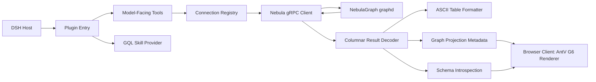

This is a TypeScript ESM package that packages a DeepSeek Harness plugin plus a browser-side graph renderer. It speaks NebulaGraph **v5 ISO-GQL** only (as documented in the bundled gql-query-generator skill plus explicitly confirmed catalog statements) — open-source nGQL is not referenced.

The plugin entry is index.ts. It validates configuration, creates one `ConnectionRegistry` per plugin instance, registers the tools and bundled GQL skill provider, adds system-prompt guidance, and uses Cordis cleanup effects to close all live sessions on unload.

The main query path is:

1. `nebula_connect` / `nebula_execute` / `nebula_disconnect` are registered in tools.ts. They are the model-facing boundary: validate inputs, maintain `connectionId` state, format results, and attach optional presentation metadata.
2. registry.ts maps each opaque `connectionId` to an authenticated `NebulaClient`, which preserves server-side state such as the `SESSION SET graph` working graph (tracked as `entry.currentGraph` when `nebula_execute` sees a `SESSION SET graph <name>` statement).
3. nebula-client.ts is the transport layer. It loads NebulaGraph v5 protobuf definitions, authenticates and executes queries over gRPC, applies deadlines, and sends `SESSION CLOSE` during shutdown.
4. The client passes Nebula's columnar `VectorResultTable` through the decoder package rooted at index.ts, producing JSON-safe rows containing scalars, composites, nodes, edges, and paths.
5. format.ts renders these decoded rows as ngql-style ASCII tables. graphData.ts separately extracts node/edge/path cells into a bounded `{ nodes, edges }` graph projection.

**Schema exploration** lives in schema.ts. `nebula_schema` runs `SHOW GRAPHS`, resolves the target graph (explicit `graph=` argument → tracked working graph → the sole graph), then `DESC GRAPH TYPE <graph_type>` and parses the catalog rows: node types (`entity_type = Node`) and edge types (`entity_type = Edge`), with labels, primary/multiedge keys, and properties. Edge `type_pattern` values like `(Actor)-[Act]->(Movie)` directly yield each edge's source/target node types, so a graph type's schema is itself a small directed graph. The tool projects that schema meta-graph (`{ kind: 'schema', nodes, edges }`) into the tool-result meta and renders an ASCII dump as its canonical text.

The web-client half lives in index.tsx. It listens for `tool/result` events containing graph metadata and mounts an interactive AntV G6 visualization; text-table output remains the canonical normal result. Two payload kinds share one conversation node: data graphs from `nebula_execute` (force-directed layout) and schema meta-graphs from `nebula_schema` (card vertices showing the type name, labels, 🔑 primary key, and properties; arcs between a pattern's source/target node types; layered dagre layout).

The skill system is independent of query execution: skill.ts exposes the packaged gql-query-generator directory through DSH's skill registry, so an agent can load GQL-writing guidance and its reference documents.

Build output is intentionally split: TypeScript compiles src to lib, copy-proto.mjs ships and embeds protobuf files, and build-client.mjs bundles the React/G6 client as client.js for DSH's web module loader. Tests cover decoding, formatting, tools, schema parsing, skill registration, graph extraction, and a real in-process gRPC flow; the latter is represented by client.test.ts.
